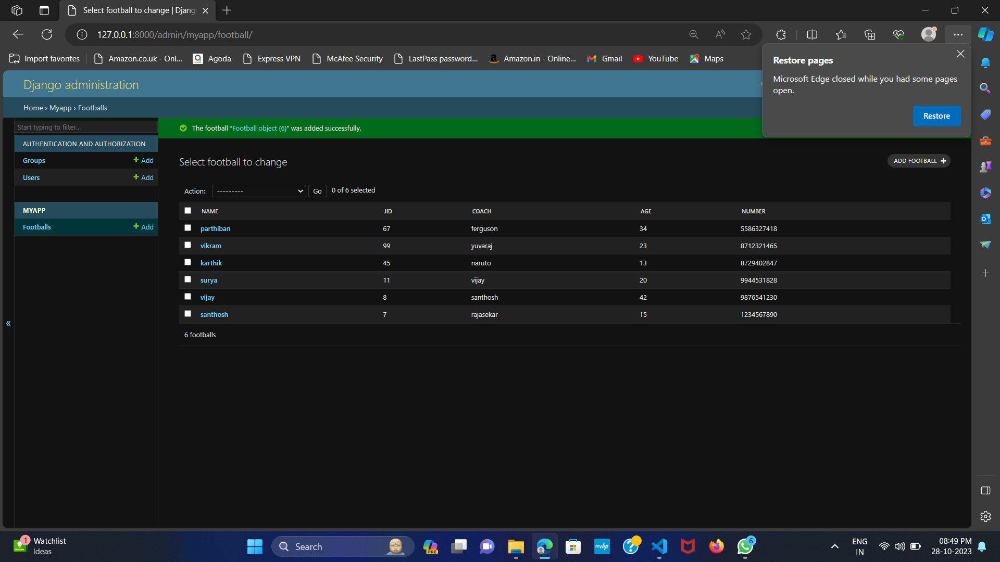

# Ex02 Django ORM Web Application
## Date:07/10/2023

## AIM
To develop a Django application to store and retrieve data from a Football Players database using Object Relational Mapping(ORM).

## DESIGN STEPS

### STEP 1:
Clone the problem from GitHub

### STEP 2:
Create a new app in Django project

### STEP 3:
Enter the code for admin.py and models.py

### STEP 4:
Execute Django admin and create 10 Football players

## PROGRAM
```
Admin.py

from django.contrib import admin
from .models import Football,FootballAdmin
admin.site.register(Football,FootballAdmin)

Model.py

from django.db import models
from django.contrib import admin
class Football(models.Model):
    name=models.CharField(max_length=100)
    jid=models.IntegerField()
    coach=models.CharField(max_length=100)
    age=models.IntegerField()
    number=models.IntegerField()

class FootballAdmin(admin.ModelAdmin):
    list_display=('name','jid','coach','age','number')
```

## OUTPUT



## RESULT
Thus the program for creating a database using ORM hass been executed successfully
